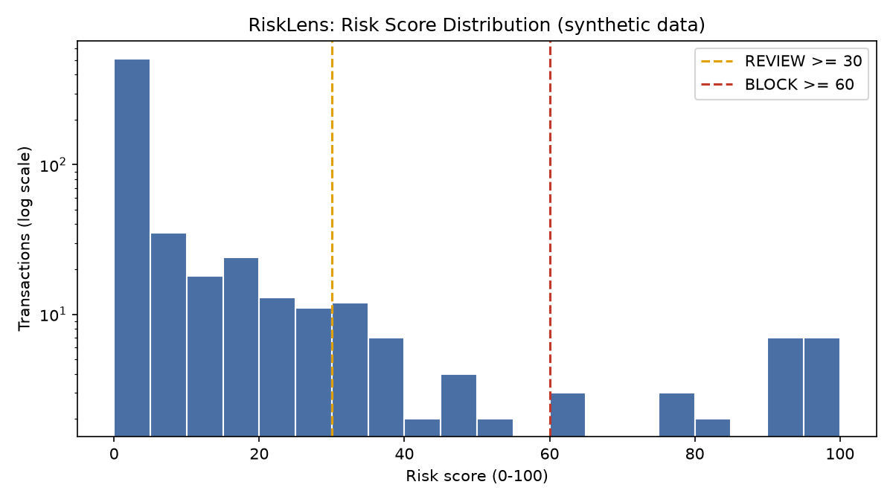
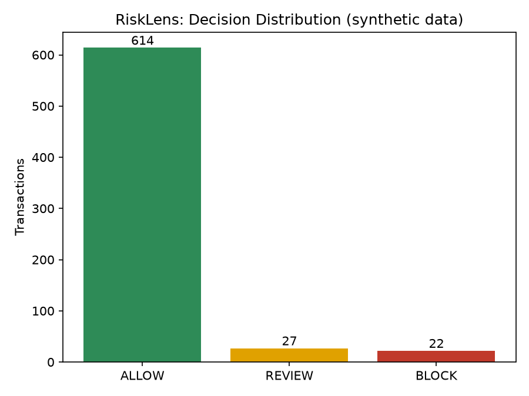
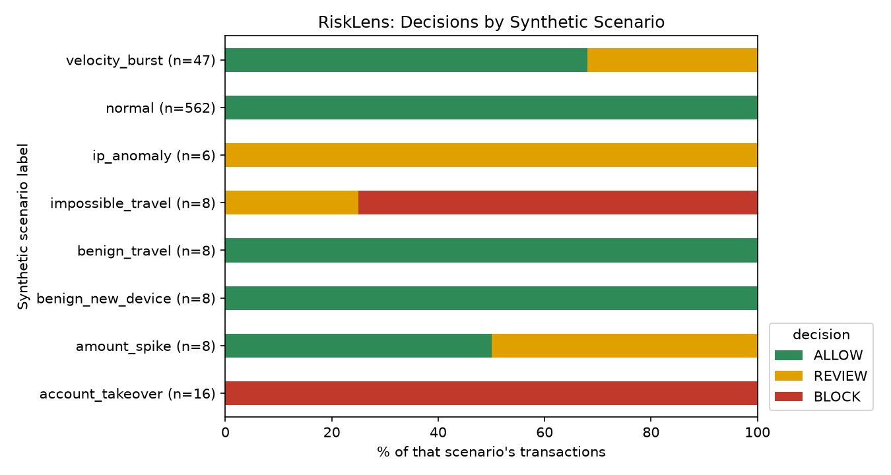

# RiskLens — Explainable Transaction Security Risk Engine

**RiskLens scores synthetic financial transactions from 0 to 100 using transparent, rule-based security controls, then returns an `ALLOW` / `REVIEW` / `BLOCK` decision with a plain-English explanation of exactly which signals fired and why.**

> All data is synthetic. This is an independent learning project. It is not affiliated with, and does not use data or systems from, any financial institution.



## Why I built it

I wanted to better understand how financial platforms can translate security-risk signals into consistent operational decisions. Instead of building a black-box fraud model, I focused on transparent controls that an analyst can understand, challenge, and tune.

I'm a student, not a practicing fraud engineer, so the goal was to learn the shape of the problem: which signals matter, how to weigh them, how to explain a decision, and where a rule-based approach breaks down.

## What it demonstrates

| Area | Where to look |
|---|---|
| **Security risk analysis** | Nine controls covering account takeover, card-testing, and travel-based signals (`src/rules.py`) |
| **Transaction monitoring** | Chronological scoring with per-user behavioral baselines (`src/risk_engine.py`) |
| **Risk controls** | Each control is a small pure function with a documented weight rationale |
| **Explainable scoring** | Every score is an additive "receipt" of triggered controls and points |
| **Operational decisioning** | Configurable ALLOW / REVIEW / BLOCK thresholds and an analyst-ready flagged queue |
| **Data analysis** | Seeded synthetic data, per-scenario breakdowns, control-frequency analysis (`src/reporting.py`) |
| **Python engineering** | Typed, modular code with a single config object and no framework bloat |
| **Testing and CI** | 39 pytest tests; GitHub Actions runs them plus a full pipeline smoke test |

## Architecture

```
 Synthetic            Risk signals            Control evaluation            Risk score
 transactions   -->   (per user history,  --> (9 pure-function      -->     (sum of points,
 (seeded, no          no look-ahead)           controls)                     capped at 100)
  real data)                                                                       |
                                                                                   v
                       Analyst report   <--    ALLOW / REVIEW / BLOCK   <---  thresholds
                       (CSV, JSON, PNG)        + explanation                  (30 / 60)
```

More detail and design decisions: [`docs/architecture.md`](docs/architecture.md).

## Risk controls

Weights are **illustrative**. They rank stronger signals above weaker ones; they are not statistically calibrated. Rationale for each is documented at the top of [`src/rules.py`](src/rules.py).

| Control | Purpose | Example signal | Risk contribution |
|---|---|---|---|
| Transaction velocity | Catch bursts typical of card testing or automation | 4+ attempts in 10 minutes (6+ is heavier) | +15 / +25 |
| Unusual amount | Catch spend far outside a user's own norm | Amount is 4x / 8x / 12x the user's median | +12 / +20 / +30 |
| New device | Flag a device never seen on a trusted transaction | `DEV-ATK-007` not previously used | +15 |
| New country | Flag a country not previously tied to the user | `AU` when history is only `US` | +20 |
| IP reputation | Weight riskier (synthetic) IP reputation more heavily | Reputation score 50 / 70 / 85+ out of 100 | +10 / +20 / +30 |
| Impossible / implausible travel | Detect distant locations too close in time | 7,084 km in 1.1 h (~6,160 km/h) | +30 (impossible), +15 (implausible) |
| New account | Newer accounts carry more risk | Account under 7 / 30 days old | +10 / +5 |
| Failed logins | Credential-stuffing or takeover precursor | 3+ / 5+ failed logins before the transaction | +10 / +15 |
| High-risk merchant category | Categories common in cash-out or laundering | `gift_cards`, `crypto_exchange`, `wire_transfer` | +8 |

**Decision thresholds:** `0-29` ALLOW · `30-59` REVIEW · `60-100` BLOCK.

**Design principle:** no single weak signal can BLOCK. Blocking needs several independent signals to agree.

## Example decision

A real output from this repository's default run (`TXN-000589`, synthetic user `U0032`). The user's previous trusted transaction was in Chicago, US, 1.1 hours earlier:

```
Risk score: 60/100 -> BLOCK (REVIEW >= 30, BLOCK >= 60)
Triggered controls:
  - New country: +20 (DE not in previously seen countries (US))
  - High-risk IP: +10 (IP 198.51.100.117 reputation risk 52/100)
  - Impossible travel: +30 (7,084 km in 1.1 h (~6,160 km/h))
```

An analyst can check every line: the points add up to the score, and each detail can be verified against the raw transaction in `output/scored_transactions.csv`.

## Results from the default run

These numbers come from `python main.py` with the default seed (42) and are stored in [`output/risk_summary.json`](output/risk_summary.json).

| Metric | Value |
|---|---|
| Transactions analyzed | 663 |
| ALLOW | 614 (92.6%) |
| REVIEW | 27 (4.1%) |
| BLOCK | 22 (3.3%) |
| Average risk score | 6.32 |
| Highest risk score | 100 |



Because I designed the synthetic scenarios and the controls together, the table below shows that the **controls behave as designed**. It is *not* a measure of real-world detection accuracy.

| Synthetic scenario | Transactions | ALLOW | REVIEW | BLOCK |
|---|---:|---:|---:|---:|
| normal | 562 | 562 | 0 | 0 |
| benign_new_device | 8 | 8 | 0 | 0 |
| benign_travel | 8 | 8 | 0 | 0 |
| account_takeover | 16 | 0 | 0 | 16 |
| impossible_travel | 8 | 0 | 2 | 6 |
| ip_anomaly | 6 | 0 | 6 | 0 |
| amount_spike | 8 | 4 | 4 | 0 |
| velocity_burst | 47 | 32 | 15 | 0 |

Two honest observations from this table: velocity bursts are only caught once the count crosses the threshold (early transactions in a burst pass), and half of the amount spikes slip through because a lone weak signal is intentionally not enough to escalate. Those are trade-offs of the design, and exactly the kind of thing an analyst would want to tune.



## Tech stack

Python 3.11+ · Pandas · NumPy · Matplotlib · Pytest · GitHub Actions

## Running the project

```bash
git clone <your-repository-url>
cd risklens
python -m venv .venv
source .venv/bin/activate        # Windows: .venv\Scripts\activate
pip install -r requirements.txt
python main.py
```

`python main.py` generates the synthetic data, scores every transaction, writes the reports, and renders the charts:

| Path | Contents |
|---|---|
| `data/synthetic_transactions.csv` | Generated input data |
| `output/scored_transactions.csv` | Every transaction with score, decision, triggered controls, explanation |
| `output/flagged_transactions.csv` | REVIEW and BLOCK transactions, highest risk first |
| `output/risk_summary.json` | Aggregate statistics |
| `docs/*.png` | Charts |

Optional flags: `python main.py --seed 7 --users 80` for different reproducible data.

## Testing

```bash
python -m pytest -q
```

The 39 tests cover each control, score capping at 100, threshold-to-decision mapping, the no-baseline (cold start) behavior, blocked events not polluting a user's baseline, generator reproducibility, and a check that every generated IP address comes from the reserved documentation ranges. CI runs the tests and the full pipeline on Python 3.11 and 3.12 (`.github/workflows/tests.yml`).

## Project limitations

- **The data is synthetic.** It was generated by code I wrote, so its patterns are simpler and cleaner than real customer behavior.
- **The rules are illustrative.** Weights and thresholds reflect my reasoning about relative signal strength, not evidence.
- **This is not a production fraud system.** It has no real-time processing, identity verification, or case management.
- **Thresholds are not calibrated on real financial institution data.** The scenario table above shows internal consistency, not accuracy.
- **False positives and false negatives would need to be evaluated in a production system.** There are no real labeled outcomes here to measure precision or recall against.
- **Real systems need many more signals**: authentication strength, identity and KYC data, richer behavioral and device fingerprints, network intelligence, and regulatory and compliance context.
- Known design gaps: a first-time user has no baseline, so baseline controls stay silent; the travel control uses the last *trusted* location only; a compromised device the user has used before would not trigger the new-device control.

## Future improvements

These are ideas, **not** implemented features:

- Configurable rule weights loaded from a file, with a threshold tuning workflow
- Analyst feedback loop (confirmed fraud / false positive) to adjust weights
- Precision / recall evaluation against labeled outcomes
- Real-time (streaming) event processing
- Graph-based account relationships (shared devices and IPs across accounts)
- Statistical anomaly detection layered on the rules
- ML model comparison against the rule-based baseline
- Drift monitoring for score and signal distributions
- A case-management dashboard for analysts

## Repository layout

```
risklens/
├── main.py                  # CLI entry point
├── src/
│   ├── models.py            # Transaction, RiskSignal, RiskAssessment, UserHistory
│   ├── rules.py             # RuleConfig + the nine controls
│   ├── risk_engine.py       # scoring, decisions, explanations
│   ├── data_generator.py    # seeded synthetic data
│   ├── reporting.py         # summaries and CSV/JSON output
│   ├── visualization.py     # matplotlib charts
│   └── utils.py             # paths, haversine distance
├── tests/                   # pytest suite
├── data/ output/ docs/      # generated data, reports, charts, architecture notes
└── .github/workflows/tests.yml
```

## License

MIT. See [`LICENSE`](LICENSE).
